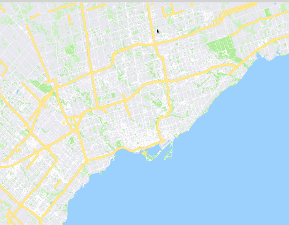

# Google-Maps
A GIS that is similar to Google Maps, implemented in C++

Presentation links: [Graphics Review](https://docs.google.com/presentation/d/1rdAkkyjZ_yPaqQKiXzyrjdr6PVCrfol36vEx2Q3rcfk/edit?usp=sharing) | [Final Presentation](https://docs.google.com/presentation/d/1ELgdlmT1w3ACMy1jetOBiY3p6HMXdxClq4NirpYgkvc/edit?usp=sharing)

 &nbsp; 

 &nbsp; 
